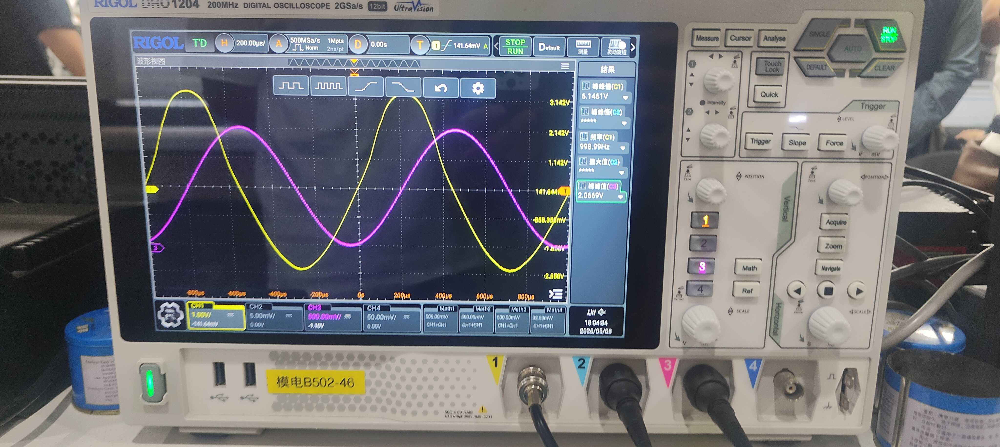
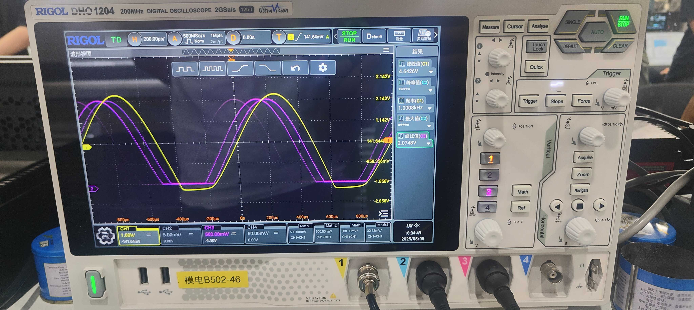

# :rocket: Project Guide :rocket:

This circuit synthesis experiment designs three main task requirements, mainly including the study of non-linear distortion of amplifiers, precision DC regulated power supplies, and flame detection circuits. It involves using tools such as STM32CubeMX, Keil, Autium Designer, and Multisim for circuit design, circuit simulation design, single - chip microcomputer peripheral configuration, code logic design, and circuit board design, among many other task practices. The purpose of this experimental project is to deepen the understanding of circuit principles and single - chip microcomputer applications and improve practical operation ability through practical operations. At the same time, the specific experimental design reports will be continuously updated in the [source](source) folder each time, and the corresponding code files are stored in the [src](src) folder. Next, I will introduce in detail the design steps, circuit wiring, code design and other detailed information of each project for your reference.  

## :mag: 1.Non-linear Distortion of Amplifiers

In the first experiment, we used an amplifier circuit composed of a common-emitter amplifier circuit and a class-B amplifier circuit. The specific schematic diagram can be viewed through [Schematic Diagram](assets/Amplifier.pdf). In the amplifier circuit, the CD503 chip needs to control the on-off of the RP4 - RP7 resistors through a single-chip microcomputer to achieve the output of waveforms with no distortion, top distortion, bottom distortion, and two-way distortion. At the same time, it is required to control the touchable serial port screen to achieve the synchronous output of the single-chip microcomputer-controlled D/A and the amplifier waveform, and display it on the oscilloscope. Next, I will specifically describe the specific steps of each step in the experiment, including the difficulties encountered and my own design.  
The design requirements for nonlinear distortion of transistors are: (1). Design and fabricate a device for studying the nonlinear distortion of an amplifier. A sinusoidal wave with a frequency of 1kHz and a peak-to-peak value of 20mV output by the signal source serves as the input voltage $u_i$ of the transistor amplifier. The test port TP1 should output a waveform $u_o$ with no obvious distortion (i.e., a distorted waveform), and the peak-to-peak value should be no less than $2V_{pp}$:
    - The amplifier should be able to output a sinusoidal voltage $u_{o1}$ with no obvious distortion.
    - The amplifier should be able to output a waveform $u_{o2}$ with "top-clipping distortion".
    - The amplifier should be able to output a waveform $u_{o3}$ with "bottom-clipping distortion".
    - The amplifier should be able to output a waveform $u_{o4}$ with "double-sided clipping distortion".  
    Note: The experimental circuit is powered by DC +/-9V.  
(2).Control the TP1 to output different waveforms through the serial port screen. When TP1 outputs different waveforms, TP2 should synchronously output the corresponding waveform with a peak value of $2V_{pp}$.

  

___1.Interface design___: For this interface design, we used the VGUS2020 development tool. First, we used the drawing tool of WPS and MATLAB to draw the graphic elements we needed, and then combined them into a picture as our main interface. Among them, for the specific waveforms designed without distortion, top distortion, bottom distortion, and bidirectional distortion, we control the switching of the corresponding interfaces through the button deployment of VGUS2020, and use AI-generated voice as the prompt tone. Finally, a test was conducted using the virtual serial port assistant. It was found that clicking on the serial port screen could return the data stream normally, thereby enabling control by the single-chip microcomputer. It should also be mentioned that in this experiment, we used the USB-TTL serial port to assist in whether the data transmission of the serial port virtual test was correct.  

    <a href="assets/results/1_实践连线图.jpg" target="_blank">
        

            
            
        

    </a>

| No Distortion | Top Distortion | Bottom Distortion | Bidirectional Distortion |
| :----: | :----: | :----: | :----: |
|  |  |  |  |

___2.Circuit Fine-tuning___: In this experiment, we used an oscilloscope to assist in the research on the nonlinear distortion of the amplifier. As can be seen from the schematic diagram of the amplifier below, we need to continuously adjust the appropriate resistance values of RP1, RP2, and RP4 to RP7, so that subsequently, only the CD503 chip is used to control the switching of S2 to S5. Realize the output of waveforms corresponding to no distortion, top distortion, bottom distortion and bidirectional distortion. The waveforms we fine-tuned in the experiment are shown as follows.  

| Voltage/V | No Distortion | Top Distortion | Bottom Distortion | Bidirectional Distortion |
|  :----: | :----: | :----: | :----: | :----: |
| 20mV |  |  |  |  |
| 30mV |  |  |  |  |

___3.Code Design___: Here, we use stm32cubemx to set the needy parameters or settings of stm32f103c8t6 such as the SYS, USART(PC6-PC7), GPIO, DAC and so on. After finishing the setting, we will click the button of Generate Code to redirect to keil to generate the corresponding code. And we should design the code in keil to receive control signal from screen and decide the waveform of I/O's output. You will see the system architecture diagram below and [source code](src/EXP1_Zeng/Core/Src/main.c). We design the code for communication between the microcomputer and screen through the serial port signal, and then use the the last frame of hexadecimal signal judge the control command generated by the user. All in all, we initialized the PA4 as DAC output port and PB3/PB5/PB7 as control port for CD503 chip.  

## :mag: 2.Precision DC Regulated Power Supplies

In the second experiment, we need to attempt to design a precise step-down output circuit. The main requirement are as follows:  Design and fabricate a step-down precision DC switching regulated power supply with the step-down converter XL1509-ADJ as the core component.(1). When the rated input DC voltage is DC +9 ~ +15V, the rated output DC voltage is +5(±0.05V test load RL = 5Ω - 1kΩ). And test the output power supply ripple. (2). The power supply can be turned off and on through the serial port screen, and the output current can be displayed. (3). The output voltage of the power supply can be controlled through the serial port screen. The output voltage range is DC +2 ~ 7.5V with a step of 0.1V. The test load RL = 100Ω / 5Ω.  

___1.Circuit Design___: The XL1509 is a high - efficiency step - down DC - DC converter with a fixed switching frequency of 150KHz. It can provide an output current capacity of up to 2A and features low ripple, excellent line regulation, and load regulation. The XL1509 incorporates a fixed - frequency oscillator and a frequency compensation circuit, which simplifies the circuit design.  
___Power Filter Circuit___: The external +24V input power supply is filtered by capacitors to remove noise before being input to the VIN pin. Here, CIN is a large - capacity electrolytic capacitor of 470μF with a voltage rating of 50V, indicating that the input voltage must not exceed 50V, otherwise the capacitor will be reversely broken down; C1 is 1μF. The method of connecting a large capacitor in parallel with a small capacitor enables both low - frequency and high - frequency signals to pass through well, and can effectively eliminate the high - and low - frequency AC noise on the input signal source.  
___Buck Circuit___: In this circuit, the diode, capacitor, inductor, etc. of the Buck circuit are located in the external circuit. Inside the chip, the switching module is integrated in the Darlington transistor section. A pulse - width modulation (PWM) wave with a specific duty cycle generated through feedback controls the on - off state of the TTL switch.  
___Feedback Control Circuit___: When a low level is input to the EN pin, the chip operates normally. The FB feedback pin is connected to the output voltage terminal through resistor voltage division. If the output voltage is lower than 5V, the voltage output by the feedback pin is 1.23V. The error between the feedback pin voltage and 1.23V is amplified inside the chip, which controls the next - stage circuit to generate a PWM wave with a larger duty cycle, thereby increasing the output voltage to 5V. If the output voltage is exactly 5V, the feedback pin voltage = 1.23V, and the error is 0. At this time, the duty cycle of the PWM wave remains unchanged. If the output voltage is higher than 5V, the voltage output by the feedback pin is 1.23V. After the chip internally amplifies the error between the feedback pin voltage and 1.23V, it controls the next - stage circuit to generate a PWM wave with a smaller duty cycle, which can reduce the output voltage to 5V. Through such a continuous dynamic adjustment process, the circuit can achieve a stable 5V DC output voltage. The capacitor C4 connected in parallel with R2 is a compensation capacitor, which provides additional stability for the system.  

    

        
        
    

___2.GUI Design___: For the experimental interface display, as shown in Figure 2, a VGUS display interface was designed. Using WPS PPT, functional components were drawn, including on/off buttons for enabling/disabling functions, digital display modules for showing output voltage and current, and button control components for adjusting output voltage (with a step size of 0.1V for increment/decrement), realizing user control over the stepped-down output voltage. Meanwhile, a virtual simulation serial port was used for testing to ensure that key value feedback matches the pre-set target values. The project files of GUI Screen are [here's](/ui/EXP2_ScreenUI) folder.  

## :mag: 3.Flame Detection Circuits

In the third circuit experiment, we need to use resistors to replace thermistors for flame detection: when the fire grows larger, the resistance values of R1 to R10 connected to the circuit gradually decrease, and an alarm will be triggered when the resistance values are lower than a certain threshold. Therefore, this experiment mainly has two tasks:(1). Design using Multisim: perational amplifier selection: LM324/OP07. Transformer: Simulation using an ideal transformer; Simulation using the UU9.8 - 50mH model; Differences from the ideal transformer and how to improve the circuit. (2). Reasonable debugging. What are the differences between simulation and actual measurement?  

___1.Circuit Design___: OP07 and LM324 are two different types of operational amplifiers, each with its applicable scenarios, advantages, and disadvantages. OP07 is a high-precision operational amplifier, and its main advantages include:(1).High precision: OP07 has very small input bias current and input offset voltage, resulting in high output precision. It is commonly used in precision measurement and control systems. (2).Low noise: The internal circuit design of OP07 minimizes noise, making it suitable for applications requiring high-precision signal acquisition and processing. (3).Low offset voltage: OP07 has a very small offset voltage, making it suitable for applications requiring high-precision operations.  
LM324 is a commonly used operational amplifier, and its main advantages include: (1).Low cost: The manufacturing cost of LM324 is relatively low, so its price is also cheaper, making it suitable for applications with low cost requirements. (2). High output current: LM324 has a relatively high output current, making it suitable for applications requiring high-current drive. (3).Wide input voltage range: LM324 has a relatively wide input voltage range, making it suitable for applications requiring the processing of relatively large signals. Finally, two OP07s are used for the first and second - stage amplification in the designed circuit diagram, and an LM324 is used for the third - stage amplification. Note that the signal output from the second - stage amplification is a half - wave rectified waveform, and the output of the third - stage is the finally detected DC voltage value and according to the circuit diagram shown.  

    

        
        
    

___2.Circuit Tuning___: After the circuit is soldered, a 100Hz square wave signal with 3.3V needs to be input to the board through an amplifier. However, the signal after passing through the transformer may have some impulse voltage due to lack of tuning. When the peak value of this impulse voltage is greater than the peak of the signal after half - wave rectification, it will lead to instability in the final voltage output at the two stages of R9 and R10. Therefore, it is necessary to tune the output and gradually change the frequency of the square wave signal until the output reaches the maximum value.  

    

        
        
    

___3.GUI Design___: The interface of this flame detection circuit experiment includes the title "Experiment 3: Flame Detection Circuit". On the left side, there is a graphical component named "Fire Alarm Indicator", which is used to visually show the fire state. The blue area in the middle displays key parameters. "Fire Threshold: 4 MΩ" indicates the critical resistance value for triggering the fire determination, and "Potentiometer Resistance: 10 MΩ" represents the currently set resistance of the potentiometer. At the bottom, there are "Increase" and "Decrease" buttons, which can be used to adjust relevant parameters. The overall layout clearly presents the key information of the experiment and the interactive controls.
And the UI project file is at the [file](ui\EXP3_Now\EXP3_Now.vt).

## :heart: 4.Thanks

In this circuit synthesis experimental course, due to my initial learning of single - chip microcomputer usage and circuit design, there were numerous difficulties. However, I'm very grateful for the assistance from senior students of previous years, and most importantly, for the help from He. This enabled our group to successfully pass this experimental course.  
