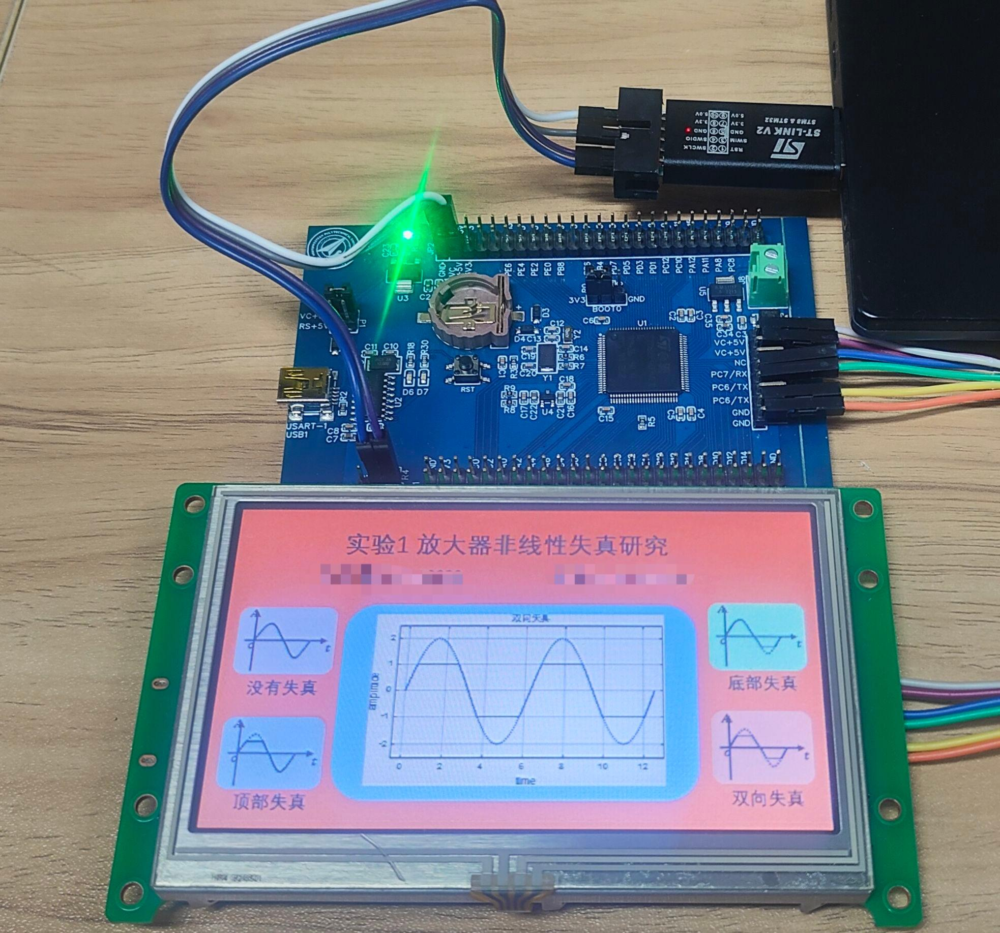
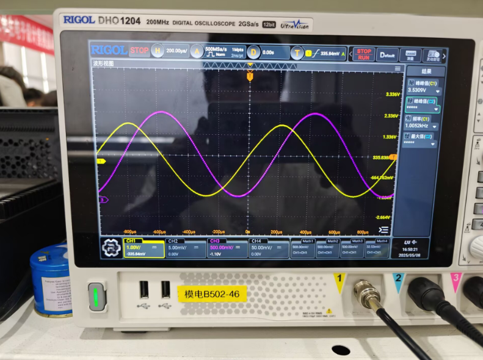

# :rocket: Project Guide :rocket:

This circuit synthesis experiment designs three main task requirements, mainly including the study of non-linear distortion of amplifiers, precision DC regulated power supplies, and flame detection circuits. It involves using tools such as STM32CubeMX, Keil, Autium Designer, and Multisim for circuit design, circuit simulation design, single - chip microcomputer peripheral configuration, code logic design, and circuit board design, among many other task practices. The purpose of this experimental project is to deepen the understanding of circuit principles and single - chip microcomputer applications and improve practical operation ability through practical operations. At the same time, the specific experimental design reports will be continuously updated in the [source](source) folder each time, and the corresponding code files are stored in the [src](src) folder. Next, I will introduce in detail the design steps, circuit wiring, code design and other detailed information of each project for your reference.  

## :mag: 1.Non-linear Distortion of Amplifiers

In the first experiment, we used an amplifier circuit composed of a common-emitter amplifier circuit and a class-B amplifier circuit. The specific schematic diagram can be viewed through [Schematic Diagram](assets/Amplifier.pdf). In the amplifier circuit, the CD503 chip needs to control the on-off of the RP4 - RP7 resistors through a single-chip microcomputer to achieve the output of waveforms with no distortion, top distortion, bottom distortion, and two-way distortion. At the same time, it is required to control the touchable serial port screen to achieve the synchronous output of the single-chip microcomputer-controlled D/A and the amplifier waveform, and display it on the oscilloscope. Next, I will specifically describe the specific steps of each step in the experiment, including the difficulties encountered and my own design.  

  

___1.Interface design___: For this interface design, we used the VGUS2020 development tool. First, we used the drawing tool of WPS and MATLAB to draw the graphic elements we needed, and then combined them into a picture as our main interface. Among them, for the specific waveforms designed without distortion, top distortion, bottom distortion, and bidirectional distortion, we control the switching of the corresponding interfaces through the button deployment of VGUS2020, and use AI-generated voice as the prompt tone. Finally, a test was conducted using the virtual serial port assistant. It was found that clicking on the serial port screen could return the data stream normally, thereby enabling control by the single-chip microcomputer. It should also be mentioned that in this experiment, we used the USB-TTL serial port to assist in whether the data transmission of the serial port virtual test was correct.  

    <a href="assets/results/1_实践连线图.jpg" target="_blank">
        

            
            
        

    </a>

| No Distortion | Top Distortion | Bottom Distortion | Bidirectional Distortion |
| :----: | :----: | :----: | :----: |
|  |  |  |  |

___2.Circuit Fine-tuning___: In this experiment, we used an oscilloscope to assist in the research on the nonlinear distortion of the amplifier. As can be seen from the schematic diagram of the amplifier below, we need to continuously adjust the appropriate resistance values of RP1, RP2, and RP4 to RP7, so that subsequently, only the CD503 chip is used to control the switching of S2 to S5. Realize the output of waveforms corresponding to no distortion, top distortion, bottom distortion and bidirectional distortion. The waveforms we fine-tuned in the experiment are shown as follows.  

| Voltage/V | No Distortion | Top Distortion | Bottom Distortion | Bidirectional Distortion |
|  :----: | :----: | :----: | :----: | :----: |
| 20mV |  |  |  |  |
| 30mV |  |  |  |  |

___3.Code Design___: Here, we use stm32cubemx to set the needy parameters or settings of stm32f103c8t6 such as the SYS, USART(PC6-PC7), GPIO, DAC and so on. After finishing the setting, we will click the button of Generate Code to redirect to keil to generate the corresponding code. And we should design the code in keil to receive control signal from screen and decide the waveform of I/O's output. You will see the system architecture diagram below and [source code](src/EXP1_Zeng/Core/Src/main.c). We design the code for communication between the microcomputer and screen through the serial port signal, and then use the the last frame of hexadecimal signal judge the control command generated by the user. All in all, we initialized the PA4 as DAC output port and PB3/PB5/PB7 as control port for CD503 chip.  

## :mag: 2.Precision DC Regulated Power Supplies

## :mag: 3.Flame Detection Circuits

## Continuous Updating
